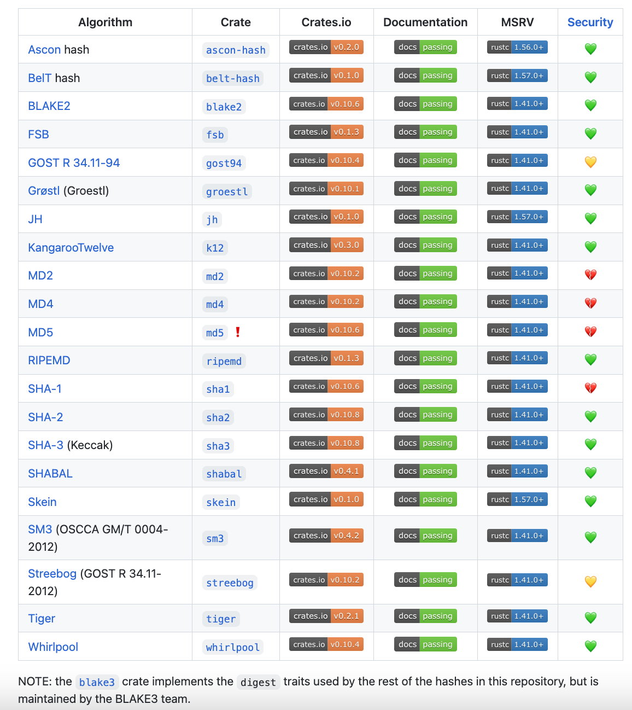
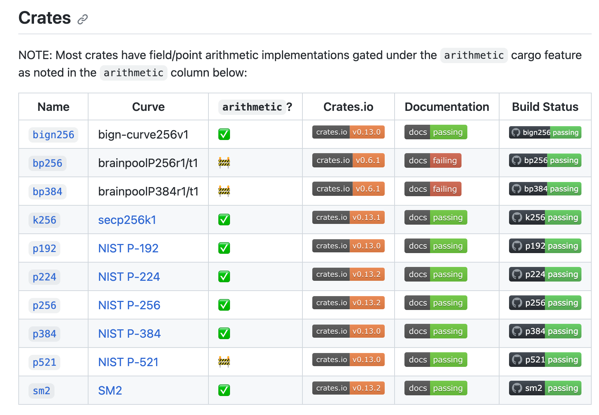

# Cryptography

Learn about cryptography concepts - Both basics and core covered here.

## Concepts

> The below concepts are in brief. For detailed explanation, navigate to the respective sections in this repository.

- **RSA vs ECC**
  - **Smaller key sizes**: RSA requires more key size than ECC for same level of security. For example, a 256-bit ECC key is generally considered to be as secure as a 3072-bit RSA key.
    - <u>Reason</u>: ECC is based on elliptic curves, whereas RSA is based on prime factorization. Elliptic curves allows efficient computation and smaller key sizes than prime factorization which requires larger key sizes for same level of security.
      - ECC is based on the difficulty of finding the discrete logarithm of a random elliptic curve element with respect to a publicly known base point. This is a one-way function, much like calculating the product of two large prime numbers. The difficulty of this function is dependent on the size of the elliptic curve, which is measured by the size of the base point order, which is a large prime number. Basically, the ECC maths is hard to solve than RSA prime factorization. Hence, ECC is more secure (with lesser key size) than RSA.
  - **Faster encryption and decryption**: ECC is generally faster in terms of encryption and decryption, especially for smaller key sizes.
  - **Lower resource consumption**: ECC operates efficiently on devices with low CPU and memory resources, making it a suitable choice for mobile devices and embedded systems.
  - **Better performance at high security levels**: ECC offers better performance at high security levels compared to RSA, making it a suitable choice for applications requiring strong security
  - RSA key generation is slower than ECC, but verification of the former is faster than the latter => 20000 RSA vs 8000 ECC key verification.
  - RSA is simpler to implement than ECC, also the former is less expensive to implement.
    > Now, that quantum computer research has advanced, ECC is more secure than RSA, but it still can be broken by quantum computers. So, the researchers are working on quantum resistant cryptography.
- In case of Ethereum, generating a **private key from a mnemonic passphrase** is a 2-step process:

  1. **Seed generation**: There is a <kbd>mnemonic passphrase (12 to 24 words)</kbd> -> <kbd>512-bit seed</kbd> using the BIP-39 algorithm.
  2. **Private key generation**: <kbd>512-bit seed</kbd> seeded with <kbd>PRNG</kbd> -> <kbd>256-bit private key</kbd>

  > This private key can then be used for a wide variety of purposes such as creating digital signatures, generating public/private key pairs and deriving key pairs for encryption.

- **Hash functions**
  

  > All hash functions are covered by RustCrypto org. [Source](https://github.com/RustCrypto/hashes) except [blake3](https://github.com/BLAKE3-team/BLAKE3).

- **ECC (Elliptic Curve Cryptography)**

  - Elliptic curve cryptography (ECC) is an approach to public-key cryptography based on the algebraic structure of elliptic curves over finite fields. Not every elliptic curve can promise strong security for practical applications. The curves used in cryptography are carefully chosen to avoid attacks and to make the mathematical computations efficient.
  - It has ECDH (Elliptic Curve Diffie-Hellman) and ECDSA (Elliptic Curve Digital Signature Algorithm) algorithms for key exchange and digital signatures respectively.
    - ECDH is used for key exchange i.e. to share a secret key between two parties i.e. for Alice and Bob to share a secret key. `private_key_A * public_key_B = shared_secret_key = private_key_B * public_key_A`
  - Using rust, there is a repository by [RustCrypto, which maintains multiple elliptic curves](https://github.com/RustCrypto/elliptic-curves). Here is a screenshot attached:
    

    > The most commonly used is secp256k1 i.e. `yˆ2 = xˆ3 + a•x + b`
    > The image above doesn't include BLS curves which is covered [here](https://github.com/KogarashiNetwork/Kogarashi/tree/master/primitive) as crypto primitives by Kogorashi Network.

- **ZKP (Zero Knowledge Proof)**

## Books

- Hacking using python - https://inventwithpython.com/hacking/ 🧑🏻‍💻
- Handbook of Applied Cryptography - http://cacr.uwaterloo.ca/hac/
- Practical Cryptography for Developers - https://cryptobook.nakov.com/ 🧑🏻‍💻

## Software tools

### Python

- Python Crypto Cheatsheets - https://www.pythonsheets.com/notes/python-crypto.html
- Python cryptography - [Github](https://github.com/pyca/cryptography) , [Website](https://cryptography.io/en/latest/)
- **Deprecated** PyCrypto - [Github](https://github.com/dlitz/pycrypto), [Website](https://www.dlitz.net/software/pycrypto/) DON'T USE THIS...
- PyCryptodome: A fork of PyCrypto (after version 2.6.1) - [Github](https://github.com/Legrandin/pycryptodome), [Website](https://pycryptodome.readthedocs.io/en/latest/) . Read the [blog](https://blog.sqreen.io/stop-using-pycrypto-use-pycryptodome/) which recommends using the new library as the old one is prone to hacking.
- pyDes: a library for DES symmetric encryption algorithm - [Github1](https://github.com/toddw-as/pyDes), [Github2](https://github.com/RobinDavid/pydes), [pip package](https://pypi.python.org/pypi/pyDes/)
- pyaes: a library for AES symmetric encryption algorithm - [Github](https://github.com/ricmoo/pyaes).
- Python-RSA: a library for RSA i.e. assymetric algorithm - [Github](https://github.com/sybrenstuvel/python-rsa)

### Rust

- Rust Crypto | All crytographic hashes: [Github](https://github.com/RustCrypto/hashes)
- Blake3 Hash in Rust: [Github](https://github.com/BLAKE3-team/BLAKE3)
- ECC: [Github](https://github.com/RustCrypto/elliptic-curves), [Documentation](https://docs.rs/elliptic-curve/latest/elliptic_curve/)
- ECC | k256/secp256k1: [Github](https://github.com/RustCrypto/elliptic-curves/tree/master/k256), [Crate](https://crates.io/crates/k256)
- ECC | BLS12-381: [Github](https://github.com/KogarashiNetwork/Kogarashi/), [Crate](https://crates.io/crates/bls-12-381/),

## Resources

- (Blog) Useful Cryptography Resources - https://blog.cryptographyengineering.com/useful-cryptography-resources/
- (Blog) RSA Algorithm in Cryptography - https://www.geeksforgeeks.org/rsa-algorithm-cryptography/
- (Blog) Adding salt to Hashing - https://auth0.com/blog/adding-salt-to-hashing-a-better-way-to-store-passwords/
- (Blog) Elliptic Curve Cryptography - https://medium.com/coinmonks/elliptic-curve-cryptography-6de8fc748b8b
