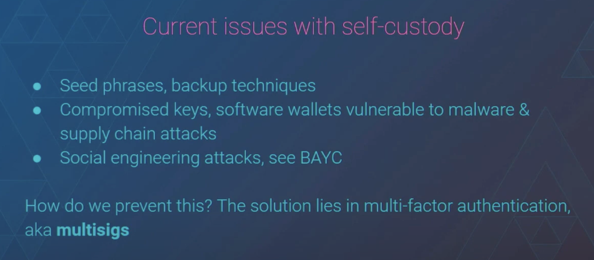
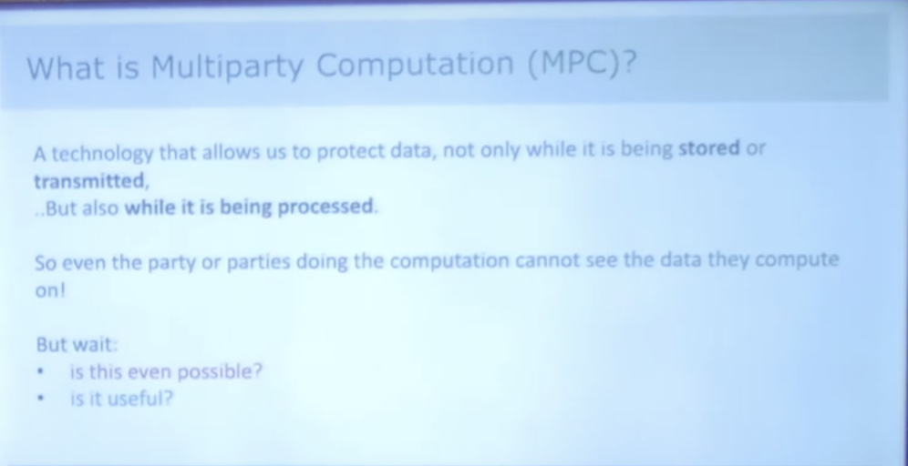
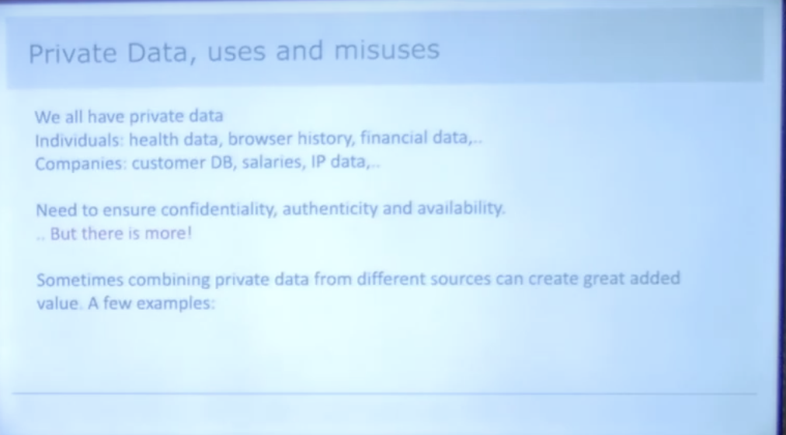
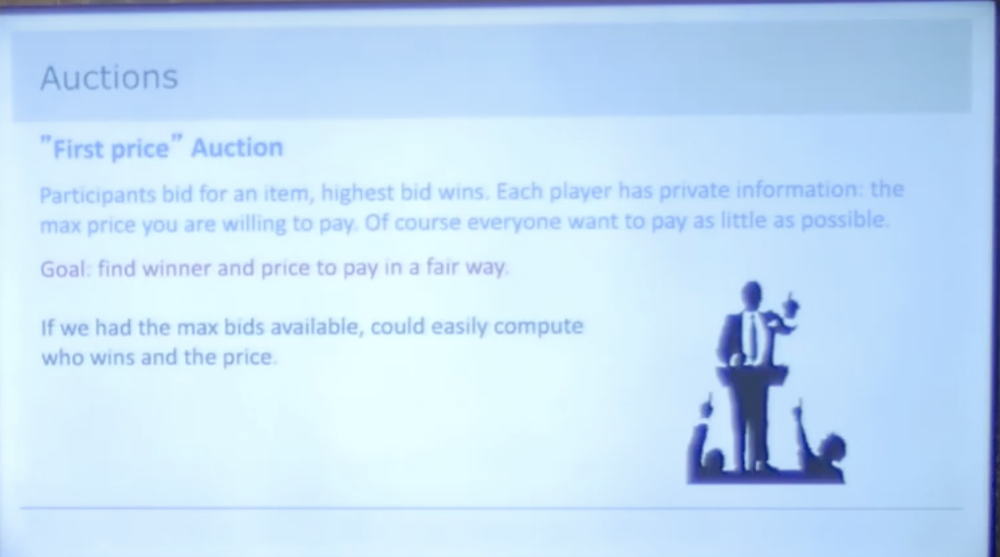
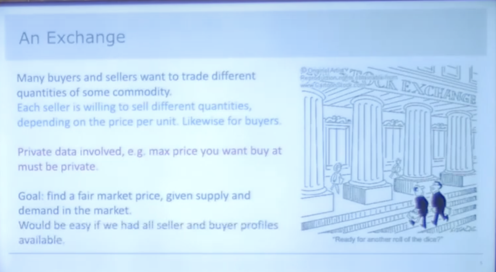

# MPC

Multi-Party Computation

## Overview

- Watch this [video](https://www.youtube.com/watch?v=vRVudJADQLk) first.
- ZKP is a special case of MPC.
- Unlike ZKP, in MPC, there is no assertion. It is a general computation like generating a private key w/o revealing any of the parts.

### Use cases

#### Smart Wallets

Motivation behind MPC-based smart wallets is to eliminate the need for private keys. Instead, the private key is split into multiple shares, and each share is held by a different party. The private key can be reconstructed only when a sufficient number of shares are combined together.

- They are very good as future wallets.
- When a transaction needs to be signed, the wallet combines the shares in a secure environment to generate the necessary signature. This method eliminates the need for a single point of failure, such as a single device or user, and makes it more difficult for hackers to steal the private key.
- Overall, an MPC wallet can provide a higher level of security compared to traditional single-key wallets, which are vulnerable to attacks such as theft, loss, or hacking.
- **Cons**:
  - If one party loses their share, the wallet is lost forever.
  - Not many libraries are available as of now.

## Concepts

## References

- [Multi-Party Computation simplified: Ivan Damgård, Co-founder/Chief Cryptographer-Partisia Blockchain](https://www.youtube.com/watch?v=vRVudJADQLk) ✅
- [The Future of Wallets: MPC vs Smart Wallets by Ivo Georgiev | Devcon Bogotá](https://www.youtube.com/watch?v=85w0TvZMivA) ✅
- [PartiHack2022 - Multi-Party Computation (MPC) 101 - Ivan Damgaard - Co-founder, Partisia Blockchain](https://www.youtube.com/watch?v=LlMGZVjcMcU) 🧑🏻‍💻
- [Multi-Party Computation: From Theory to Practice](https://www.youtube.com/watch?v=pNNLAEygPQI)
