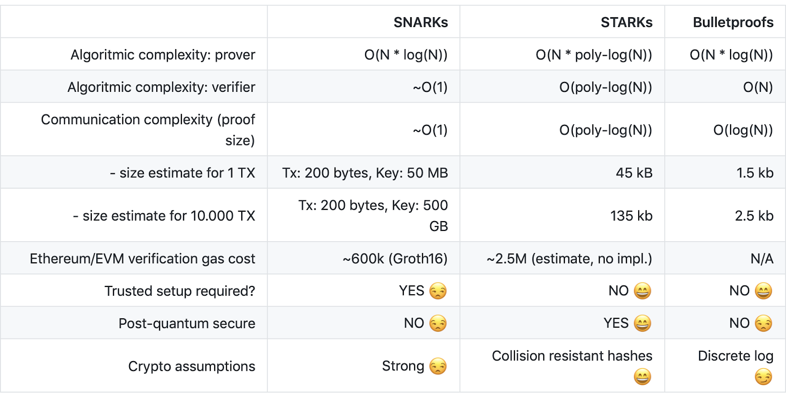
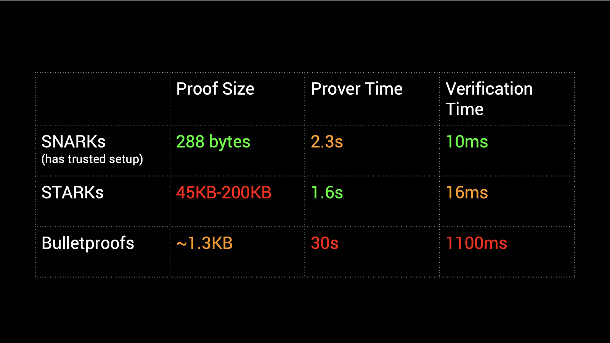
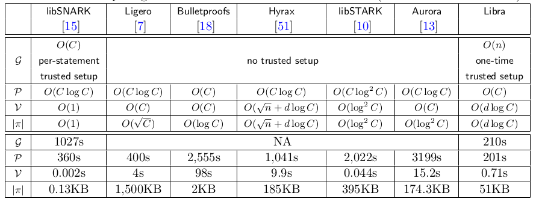
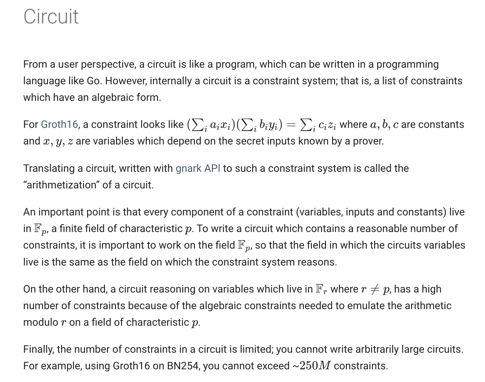

# Zero Knowledge Proof

## Overview

- Zero-knowledge protocols act (very roughly) in three steps.

  1. Setup [private (trusted)/public (transparent)]
  2. Prove
  3. Verify

  > (1) needs to be carried out once, and after this setup phase is complete, (2) and (3) can usually be repeated indefinitely, using the output of the setup. [Source](https://crypto.stackexchange.com/a/89480/106338)

- 3 core properties for any ZKP protocol:
  1. Completeness: Given a statement and a witness, the prover can convince the verifier.
  2. Soundness: A malicious prover cannot convince the verifier of a false statement.
  3. Zero-knowledge: The proof does not reveal anything but the truth of the statement, in particular it does not reveal the prover’s witness.
- Ideally, using encryption with randomization gets us to generating a proof of knowledge. And that proof is sufficient enough to be verified in an **non-interactive** way. That's why randomization/non-deteminism is important to achieve in blockchain systems, which contradicts wih the deterministic nature of blockchain systems. And therefore, we need precompiled contracts to achieve this. EVM already has that built-in. [code in VM](https://github.com/ethereum/go-ethereum/tree/91cb6f863a965481e51d5d9c0e5ccd54796fd967/core/vm). Hence, the SC doesn't need to compute that proof, but rather the involved MPCs can do that and then the SC can verify the proof.
- The challenge in ZKP is to write provable circuits with minimal constraints. Showcased in this [video](https://www.youtube.com/watch?v=umLmjsi_GbY). Reduced from `260` to `164` using an optimized code for the same circuit using ZoKrates lang.
- **Use cases**:
  - [Tornado Cash](./tornado-cash/)
  - Zcash (private transactions) -> zkSNARK Groth16
  - fast light clients/compact blockchain (Celo, [Mina](./examples/mina-protocol/))
  - Filecoin (provable decentralized storage)
    > It verifies [2M Groth16 SNARKS per day](https://spacegap.github.io/#/)
  - [Is Zero Knowledge the Future of NFTs?](https://www.youtube.com/watch?v=SDa6jZQB2mg)
    - storing metadata on-chain with ZKP
  - [Real World Use Cases that Mina Will Enable With ZK Technology | Mina Protocol](https://www.youtube.com/watch?v=rRwG8WkZYBE)
    - providing docs during loan
    - login system

## Tools

### Editor

- [VSCode](https://github.com/abhi3700/my_coding_toolkit/blob/main/vsc_all.md)
- Extensions:
  - [circom-highlighting-vscode](https://marketplace.visualstudio.com/items?itemName=iden3.circom)

## Algorithms

<u>Observations</u>:

- _verification time_ is much more important than proof _generation time_ as the latter is done only once.

### zk-SNARK

- zk-SNARK stands for zero-knowledge **S**uccinct (because of small proof size & lesser verification time) **N**on-interactive (no back & forth communication needed b/w prover & verifier) **AR**gument of **K**nowledge.
  > - Succinct: small proof size & lesser verification time
  > - Non-interactive: no back & forth communication needed b/w prover & verifier. This means when the prover submits the proof, the verifier can verify it without any further communication.
- Schemes in zk-SNARK are:
  - Groth16 (smallest & fastest to verify)
  - Libra
  - Sonic
  - SuperSonic
  - PlonK
  - SLONK
  - Halo (Halo 2 ❌ trusted setup)
  - Marlin
  - Fractal
  - Spartan
  - Succinct Aurora,
  - RedShift,
  - AirAssembly
- SNARK can have both trusted or transparent setup. But, the most successful SNARKs are the ones with trusted setup. That's why it's commonly related with trusted setup. zk-SNARKs with trusted setup are more efficient than zk-SNARKs with transparent setup or zk-SNARKs in ROM.
  
  > There are two type of setup: **trusted setup** and **transparent (public) setup**. In a trusted setup, we have a trapdoor that we should keep it secret and if attacker got it, she can prove false statements. Trusted setup should be **run once by a trusted third party**. In a **transparent** setup, **there is not any secret**. Examples of zk-SNARK frameworks with trusted setup are Pinocchio and Zcash's zk-SNARK and examples of zk-SNARKs with transparent setup are [DARK](https://eprint.iacr.org/2021/358) and Spartan, etc. [Source](https://crypto.stackexchange.com/a/89491/106338)
- Trusted setup is required in order to generate CRS (common reference string) which is used by prover & verifier to verify the proofs. Hence, it can be non-interactive & succinct. In other words, there should be some **common parameters between prover and verifier** thus they can talk to each other with the protocol and also we should convert the statement from circuit to a protocol-friendly version for proving, and it is better that we have some pre-calculations to make calculations of the above protocol efficient. [Source](https://crypto.stackexchange.com/a/89491/106338)
- Trusted setup is required. This means that the keys (b/w proof required for sending private txn & verification) are generated by a trusted party. So, these secrets need to be destroyed or else the secrets could be utilized to forge transactions by false verifications, giving the holder the ability to perform actions such as creating new tokens out of thin air and using them for transactions.
- Trusted setup requires **Powers of Tau** ceremony to be followed.
- In this ceremony after the proof generation, at least one of the relay nodes are expected to destroy their hardware (responsible for generating the keys) to ensure that the keys are destroyed.
- The most used system/protocol in SNARK is [Groth16](https://eprint.iacr.org/2016/260.pdf) by Jens Groth.
- depends on elliptic-curves.
- The proof system/protocol (Groth16) requires a **structured reference string** (SRS) i.e. a vector of elements specially crafted for a specific computation. The trusted setup (a complicated setup is required in order to generate keys that prover & verifier can use to verify the proofs.
- And because of its demand & increased usage in a network, it faces a scalability problem.
- The **reason** is that all the nodes in the network have to process each proof individually to agree on the final state, which enforces an implicit limit as to how many proofs the network can verify per day.
- Solutions to scalability issues:

  - **Proof carrying data** (currently being considered by Mina & Halo2 (Zcash)) => this would give birth to a new system/protocol creation in zkSNARK.
  - **aggregated Groth16 proofs** (currently being used by Filecoin to scale their network) together, yielding a logarithmic-sized proof and not requiring any change in the proof system/protocol itself! In other words, one can aggregate current proofs and bring scalability to the current systems without drastic changes!
    > SnarkPack can aggregate `8192` proofs in `8` seconds, producing a proof which is `38x` smaller in size and can be verified in `33ms`, including deserialization. The scheme scales logarithmically, yielding an exponentially faster verification scheme than batching: the more you aggregate, the faster you can verify a proof.

  

- Once quantum computing is largely available, the privacy technology behind SNARKs would be broken. So, zk-SNARKs are not quantum-resistant.
- SNARK was the 1st to come to the market before STARK.
- Better documentation & community support.
- txn cost for zk-SNARK is 24% of zk-STARK.
- on-chain proof size for zk-SNARK is much smaller than zk-STARK.
- There is a [spartan](https://github.com/microsoft/Spartan) repo maintained by Microsoft which is a zk-SNARK implementation in Rust.
- A `Rust` lib called [bellman](https://github.com/zkcrypto/bellman) which uses zk-SNARK's groth16 scheme.
- A `Rust` lib called [arkworks-rs/groth16](https://github.com/arkworks-rs/groth16) which uses zk-SNARK's groth16 scheme.
- A `Go` lib called [gnark](https://docs.gnark.consensys.net/en/stable/) which uses zk-SNARK's groth16 scheme.
  > 4x faster than `bellman` (written in Rust)
- A `JS` lib called [snarkjs](https://github.com/iden3/snarkjs) which uses zk-SNARK.
- A low level language called [Circom](https://github.com/iden3/circom) which helps in writing the cryptographic circuits behind zk-SNARKs. In other words, create provable programs, a.k.a programs with computational proofs.
  > Also, comes with a compiler called `Circom compiler` which compiles the circuit into a `R1CS` file and a program (in C++ or wasm) to efficiently compute a valid assignment to all wires of the circuit. Refer [this](#circom) for more.
- A high level language called **ZoKrates** which uses zk-SNARK's groth16 scheme.
- Major contributor: [arkworks](https://github.com/arkworks-rs/)
  - They have contributed mostly along with `iden3`.

### zk-STARK

- zk-STARK stands for zero-knowledge scalable **transparent** argument of knowledge.
- depends on hash function.
- That's why quantum-resistant unlike SNARK where it depends on encryption like elliptic-curves.
- less documentation
- txn cost for zk-SNARK is 24% of zk-STARK.
- on-chain proof size for zk-SNARK is much smaller than zk-STARK. That being said, STARKs have far larger proof sizes than SNARKs, which means that verifying STARKs takes more time than SNARKs and also leads to STARKs requiring more gas.
- funded by Ethereum Foundation with 12M USD.
- A language called [Cairo](https://www.cairo-lang.org/) which helps in writing the cryptographic circuits behind zk-STARKs. In other words, create provable programs, a.k.a programs with computational proofs.
- Previously, Cairo lang was based on Python, but now it's based on Rust. [repo](https://github.com/starkware-libs/cairo/), [ERC20 token](https://github.com/starkware-libs/cairo/blob/d485f5ffd0c444d900cdcac57b9e745dcc280fba/crates/cairo-lang-starknet/test_data/erc20.cairo)
- Use case:
  - In distributed computing, devices with low computing power can request a much more powerful device to perform the computation on its behalf. Later, the low-power device can verify or “check” that some larger entity with more resources is behaving correctly. This is a great strategy because verifying the computational proof is much cheaper than performing the actual computation. [Source](https://link.medium.com/TmRvViCNHwb)

### Bulletproof

- Bulletproofs are arguably not Snarks, since the verification time is not succinct.

## Languages

There has been many languages developed to help in writing the cryptographic circuits behind zkp. Here are some of them:

### [Circom](./langs/circom/)

### [Cairo](./langs/cairo/)

## Examples

Here are the examples/case studies:

- [Tornado Cash](./tornado-cash/)

## Repositories

- [Pairing cryptography library in Rust](https://github.com/zcash-hackworks/bn)
- [A protocol for private on-chain voting, implemented in Solidity | a16z backed by Andreessen Horowitz](https://github.com/a16z/cicada) 🌟🌟🌟🌟🌟

## References

- [ZKP](https://en.wikipedia.org/wiki/Zero-knowledge_proof)
- [zk-snark in _Rust_](https://github.com/zkcrypto/bellman)

### Blogs

- [Everything I know about ZKP](https://wiki.nikiv.dev/security/cryptography/zero-knowledge-proofs)
- [Understanding Zero-Knowledge Proofs Through the Source Code of Tornado Cash](https://betterprogramming.pub/understanding-zero-knowledge-proofs-through-the-source-code-of-tornado-cash-41d335c5475f)
- [Zero-Knowledge Proofs Using SnarkJS and Circom](https://betterprogramming.pub/zero-knowledge-proofs-using-snarkjs-and-circom-fac6c4d63202)
- [SnarkPack: How to aggregate SNARKs efficiently | Protocol Labs Filecoin](https://research.protocol.ai/blog/2021/snarkpack-how-to-aggregate-snarks-efficiently/)
- [Libraries for finite field, elliptic curve, and polynomial arithmetic](https://github.com/arkworks-rs/algebra)
- [What is Cairo programming language and StarkNet: A Primer on L2 blockchains](https://medium.com/@hackintoshrao/what-is-cairo-programming-language-and-starknet-a-primer-on-l2-blockchains-410203c21669)
- [Understanding Trusted Setups: A Guide](https://blog.pantherprotocol.io/a-guide-to-understanding-trusted-setups/)
- [Why it is said that “zk-SNARKs need a trusted setup” to work?](https://crypto.stackexchange.com/questions/89449/why-it-is-said-that-zk-snarks-need-a-trusted-setup-to-work/89491#89491?newreg=7d16a085016b4ae0818ac243dae94140)

### Videos

- [Computer Scientist Explains One Concept in 5 Levels of Difficulty | WIRED](https://www.youtube.com/watch?v=fOGdb1CTu5c)
- [ZK Privacy YT Playlist](https://www.youtube.com/watch?v=CgtNEALhJ3s&list=PLWACGbvIsEgn44LlTiPgVkOC4nG8tnJX-)
- [Dystopia Labs | (Part 1/3) Demystifying Zero Knowledge Proofs: How To Build DApps With zk-SNARKs](https://www.youtube.com/watch?v=_6TqUNVLChc)
- [Dystopia Labs | (Part 2/3) Demystifying Zero Knowledge Proofs: How To Build DApps With zk-SNARKs](https://www.youtube.com/watch?v=qwtOJvFo6vs)
- [Dystopia Labs | (Part 3/3) Demystifying Zero Knowledge Proofs: How To Build DApps With zk-SNARKs](https://www.youtube.com/watch?v=YymE69JcKEk)
- [Intro to Zcash | An Evening with Zooko Wilcox, Founder of Zcash (Singapore 2019)](https://www.youtube.com/watch?v=BSgMpEfTQiA)
- [Solidity Dev to ZK Dev: Why and How You Should Start ZK Dev Now](https://www.youtube.com/watch?v=wyBNZzLEgkA)
- [Scalability is Boring, Privacy is Dead: ZK-Proofs, What are They Good for? by Ian Miers](https://www.youtube.com/watch?v=AX7eAzfSB6w)
- [Proof of x from H(x) using zkSnarks for Solidity Smart Contracts](https://www.youtube.com/watch?v=NMa479P8r0Y)
- [STARKS I - Arithmetization Eli Ben Sasson Technion Cyber Computer Security YT playlist](https://www.youtube.com/watch?v=9VuZvdxFZQo)
- [StarkNet House 2022 Sessions YT playlist](https://www.youtube.com/playlist?list=PLC6CxTQU-oBgOSOdG8964L87SzjWcHtiY)
- [ZKP Workshop 2022: Dan Boneh - Constructing Modern SNARKS](https://www.youtube.com/watch?v=6psLQv5Hf_I)
- Anonymous Transaction by Blockchain Web3 MOOC
  - [Lecture 10.1: Privacy on the Blockchain](https://www.youtube.com/watch?v=rIK5np0V6P0)
  - [Lecture 10.2: Cryptographic Commitments](https://www.youtube.com/watch?v=IkNZWJFcfcU)
  - [Lecture 10.3: What is a zk-SNARK?](https://www.youtube.com/watch?v=gcKCW7CNu_M)
  - [Lecture 10.4: Private Tx Warmup](https://www.youtube.com/watch?v=gyXeYFl7HXg)
  - [Lecture 10.5: Anonymous Payments](https://www.youtube.com/watch?v=Z0s4W3UBxM8)
- ['Introduction to Zero Knowledge Proofs' - Elena Nadolinski](https://www.youtube.com/watch?v=BT88s7_VtC8)
- [A ZoKrates Update by Thibaut Schaeffer | Devcon Bogotá](https://www.youtube.com/watch?v=umLmjsi_GbY) ✅
- [Zero Knowledge Cryptography Introduction | Solidity Fridays](https://www.youtube.com/watch?v=Wne3O9P4jkw)
- [How to Architect Zero-Knowledge Blockchain Apps? | Solidity Fridays](https://www.youtube.com/watch?v=NpHKK1mSlVM)

### Motivational

- [What to know about Zero Knowledge | Devcon Bogotá](https://www.youtube.com/watch?v=hBupNf1igbY) ✅
- [Designing Public Goods Using ZKPs by Rachel | Devcon Bogotá](https://www.youtube.com/watch?v=qWcU2saOlw4)
- [Practical Use Cases for Zero-Knowledge](https://medium.com/@aleohq/practical-use-cases-for-zero-knowledge-d8e5be5dfe46)
