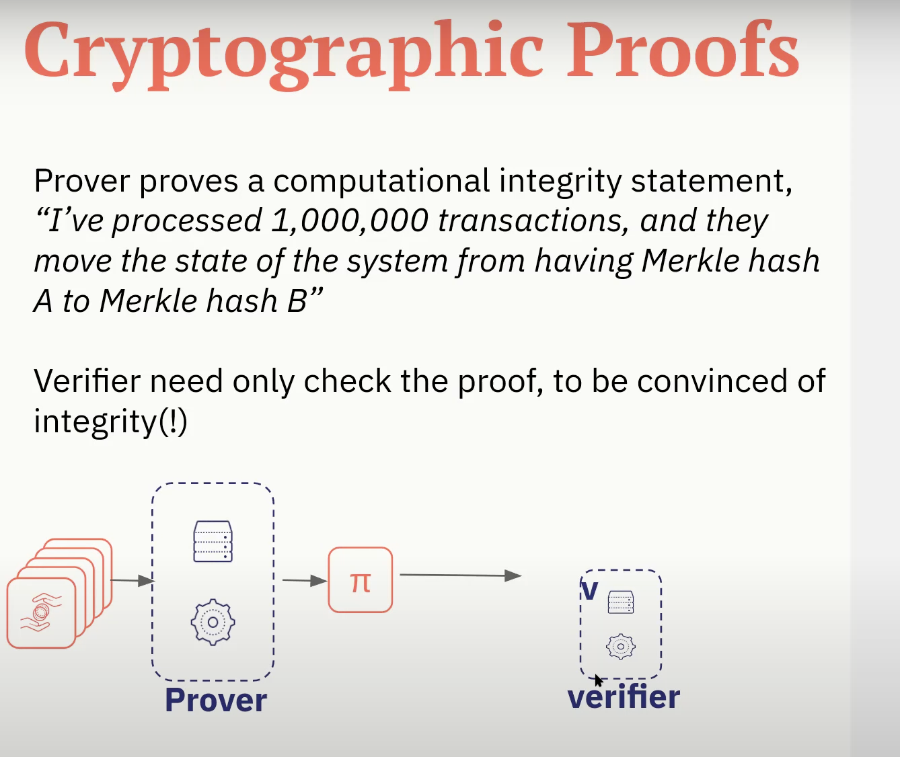
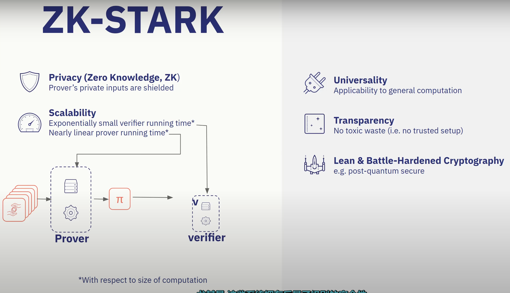
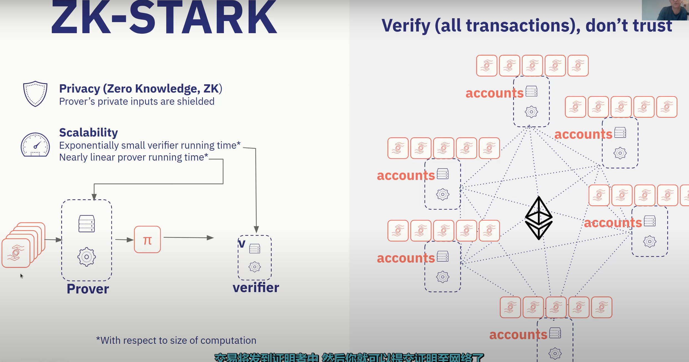
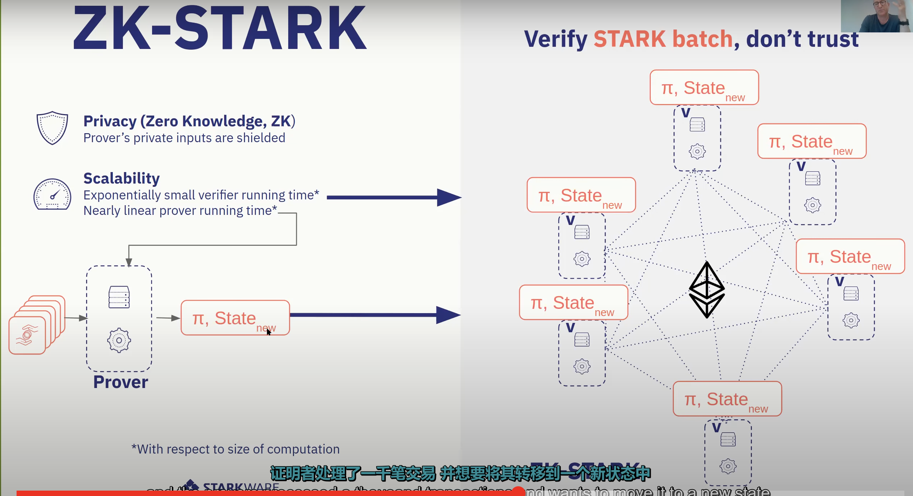
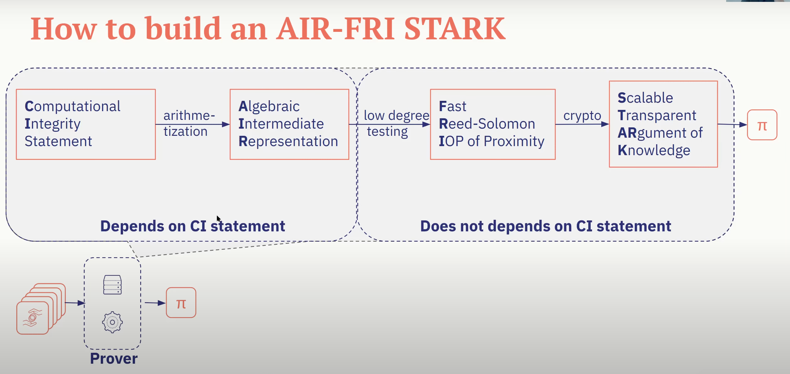
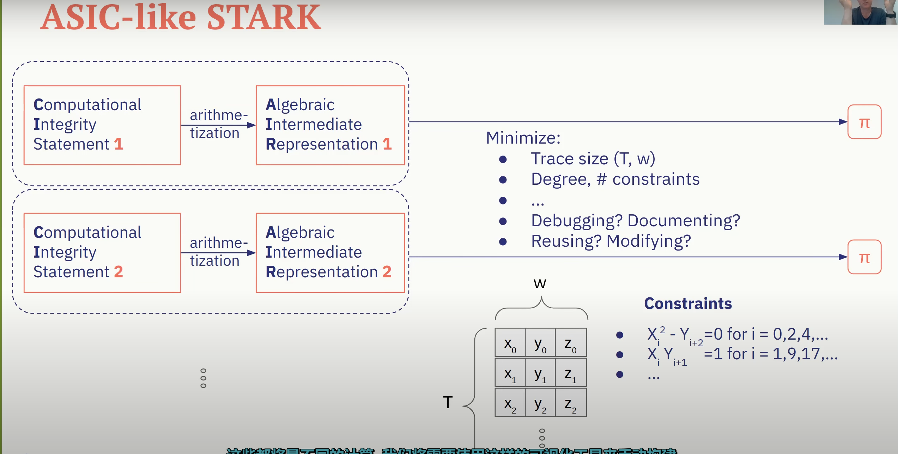
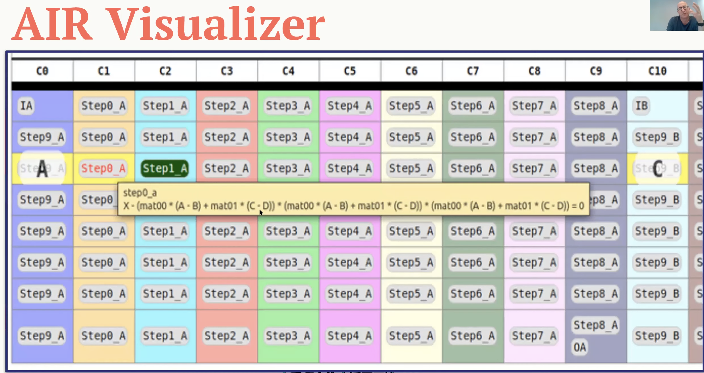
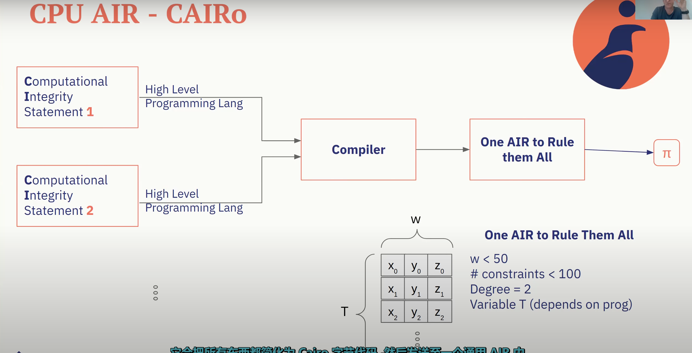
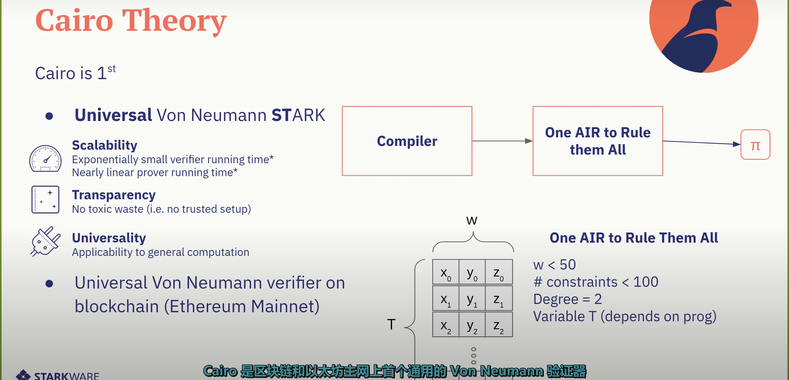
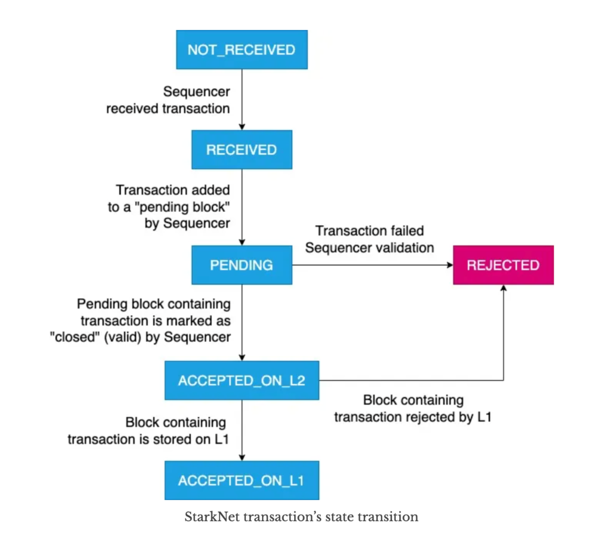

# StarkNet

## About

- StarkNet is a zk-STARKs based layer-2 scaling solution for Ethereum.
- `Cairo` is the first Turing-complete language for creating provable programs for general computation. Previously based on Python, now based on Rust.
- It enables us to write smart contracts in cairo, called StarkNet contracts. E.g. [ERC20 token](https://github.com/starkware-libs/cairo/blob/d485f5ffd0c444d900cdcac57b9e745dcc280fba/crates/cairo-lang-starknet/test_data/erc20.cairo).
- `Cairo` based on rust (previously python). [crate](https://github.com/starkware-libs/cairo/tree/d485f5ffd0c444d900cdcac57b9e745dcc280fba/crates/cairo-lang-starknet).
- STARK proof is called **AIR (Algebraic Intermediate Representation)** which is the succicnt representation of the computation. _AIR in zk-STARKs_ is the analogue of R1CS (Rank-1 Constraint System) in _zk-SNARKs_.
- The computational language is **Cairo** in case of Starknet.
- The computational language is **Rust** in case of [Winterfell](./winterfell.md).

## Installation

> For macOS M1.

refer [this](../../langs/cairo/README.md#installation) for cairo [`Rust (v1.x)`],[`Python (v0.x)`].

## Diagrams

Refer [this](./starknet.drawio).

## Concepts

**Why learn Cairo?**

- Because of scalability for chains & rollups, privacy for data from DApps with contracts (alongwith Verifier contract) integrated.

---

**How do we scale with Cairo?**

- Computational Integrity

  > "Integrity means doing the right thing when no one's watching" - C.S. Lewis

  Methods to ensure:

  - **Reputation, delegated accountability** (e.g. Banks)
  - **Naive Replay** (e.g. Bitcoin) where everyone has to verify the integrity of the transaction sent to them by the sender. During authorization, it is done by 1 node, but during finalization, it is done by all nodes.
  - **Trusted Execution Environments** (e.g. Intel SGX) where the computation is done in a secure enclave. But it is not scalable as it is not decentralized.
  - **Fraud Proofs** (e.g. Optimistic rollups) where the computation is done off-chain and the proof is submitted on-chain. But, here the fraud is detected after it is added into the block with an assumption that the proof submitted is correct.
  - Cryptographic Proofs (e.g. zk-SNARKs, zk-STARKs) where the computation is done off-chain and the proof is submitted on-chain. But, here the fraud is detected before it is added into the block as there is a one-time (throughout the lifetime of the transaction) verification of the proof submitted.

- Cryptographic Proofs
  
- STARKs
  
  Here, ∏ (pi) is the proof that is not supposed to disclose any information about the transactions.

  Currently, every participating (author + non-author) node in the network has to verify the transactions (i.e. sender's signature verification) like this:
  

  But, with zk-STARK, the proof is verified only once by the author node and then the proof is added to the block. So, the non-author nodes don't have to do anything. This is how the computation is done off-chain and the proof is submitted on-chain and the state is changed on-chain across the nodes.
  

- AIRs
  

  Every time, the execution trace is going to be different like this:
  

  AIR visualizer:
  

  Then, AIR is ensured to be one common for all the rules of the computation. So, here 2 different CI statements result in 1 common AIR instead of the previous case where there were 2 different AIRs for 2 different CI statements.
  

---

---

Starknet's transaction lifecycle:

## References

- [Understanding Zero-Knowledge Proofs in 15 Mins through SNARK and STARK](https://intelchen.medium.com/understanding-zero-knowledge-proofs-in-15-mins-through-snark-and-stark-7638311f0cc9) 🧑🏻‍💻
