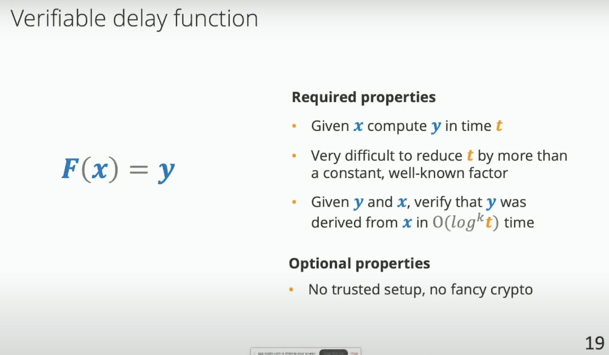
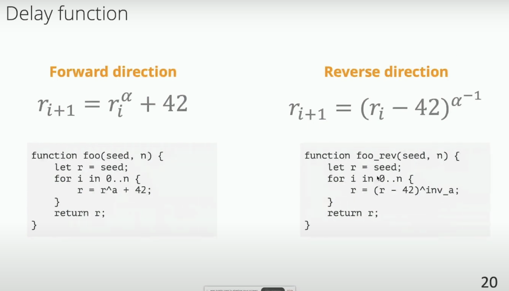

# Winterfell

## Overview

Write stark proofs using Winterfell in rust.

> There are other options like StarkWare's Cairo, but I anticipate Winterfell (from Facebook) is going to be pretty easy to use quickly.

**Components**:

- Prover
- VDF (Verifiable Delay Function)

## Installation

## Diagrams

Refer [this](./starknet.drawio).

## Concepts

---

## Coding

[Code example](../../libs/winterfell/demo)

## References

- [ZK HACK mini - Writing STARK proofs with Winterfell](https://www.youtube.com/watch?v=LBTrX0Ukdvs)
