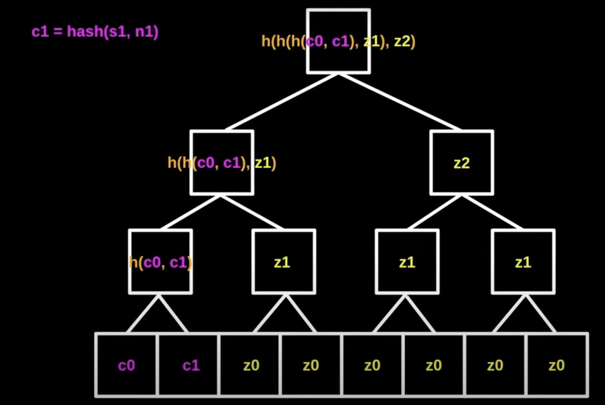

# Tornado Cash

## Introduction

- [Tornado Cash](https://tornado.cash/) is a privacy tool that allows users to mix their funds with other users in a trustless manner.
- Implements zk-SNARKs to provide privacy for Ethereum transactions.
- It has 3 components:

  - manages the ETHs going in and out of the mixer
  - maintains the merkle tree root hash of all the deposits
  - zkSNARK verifier SC that verifies the proofs submitted by the withdrawers. This has 2 parts:

    - Circom (verifier circuits)
    - `snarkjs`

    

## How it works

### Deposit

- User deposits funds into the Tornado Cash contract.
- User generates a proof (`hash(secret, nullifier)`) that the funds were deposited into the contract.
  - 2 parts
    - secret
    - nullifier (to be shared with the receiver)
- The funds has to be 1, 10, 100, etc ETH, & not so precise. Otherwise, it would be easy to identify the depositor.
- SC has a merkle root for a tree with all the hashes of the deposits as leaves.

### Withdraw

- The SC doesn't have any idea about expected withdrawer. So, anyone can claim the funds via providing dedicated proof.
- Every deposit is associated with a unique hash (`hash(secret, nullifier)`).

> Now, there could be a hack: The hacker is submitting the same proof multiple times in order to withdraw (say 1 ETH) multiple times causing "double spending".

- Every withdrawer has to submit the `hash(nullifier)` along with the proof.

- **Wrong method** ❌:

  1. The withdrawer provides the secret, nullifier i.e. `hash(secret, nullifier)`.
  2. SC then finds the deposit that matches the `hash`.
  3. But, by this the depositor's identity is _revealed_.

- **Correct method** ✅:

  

  1. The withdrawer provides the `proof` without disclosing the hash or (secret, nullifier).
  2. Now, the SC won't be able to find the deposit that matches the `hash`.
  3. But, the withdrawer has to provide the zkSNARK-proof in order to get the funds.

  

### Complete flow

E.g.

- 1st user deposits 1 ETH say.
- It generates a proof/commitment `c0 = hash(s0, n0)`. Hence, it would look like this:
  
- 2nd user deposits 1 ETH say.
  
- 3rd user deposits 1 ETH say & likewise.

So, in this way, we would be able to generate a merkle tree with all the deposits.

Now, let's say we want to see if the 3rd user's deposit is recorded in the SC's merkle tree. We would need some hashes, which are not known to the 3rd user and would look like this:

Now, from withdrawer's perspective, zk-SNARKs would help us to prove that the 3rd user's deposit is recorded in the SC's merkle tree without even revealing `c3`.

> The withdrawer is not supposed to know `c3`.

<!-- TODO: next step -->

## References

- [Tornado Cash - How it Works | DeFi + Zero Knowledge Proof](https://www.youtube.com/watch?v=z_cRicXX1jI) ✅
- [DeFi MOOC Lecture 10: Privacy on the Blockchain](https://www.youtube.com/watch?v=rIK5np0V6P0&list=PLS01nW3RtgorEzMOg2dpg7KwB5nhQHhSw)
