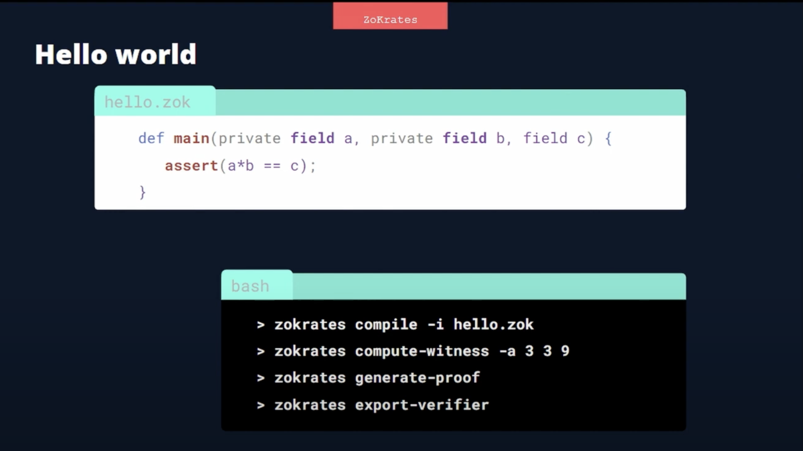
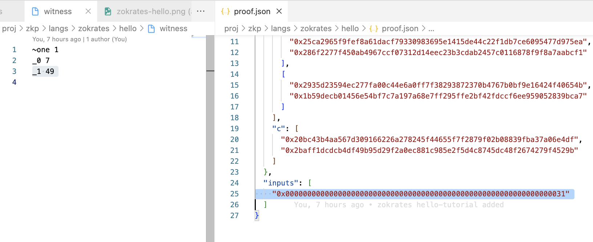
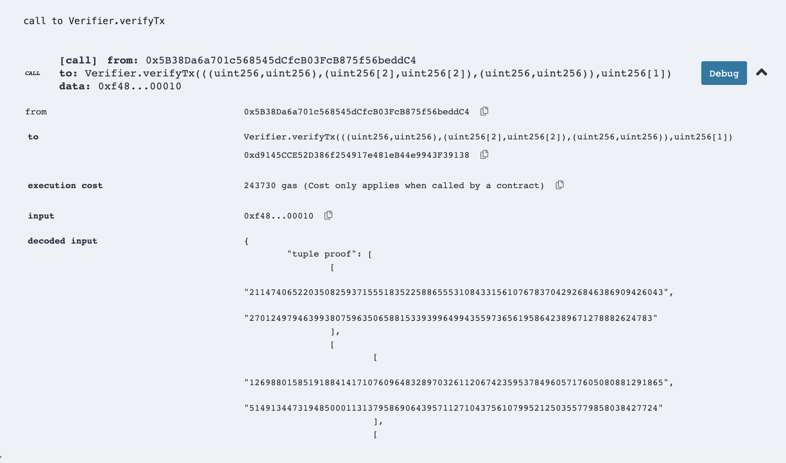
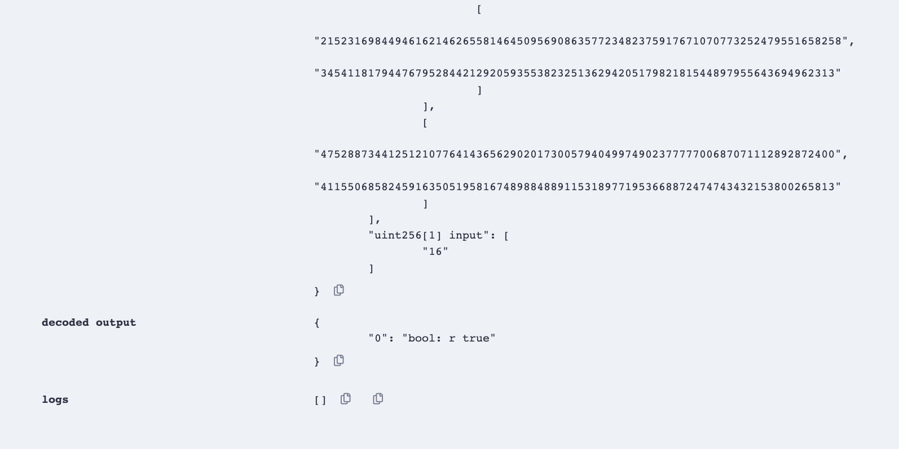

# ZoKrates

## About

- A high level language for SNARKs maths circuits, that is built on top of rust.
- Compiles to R1CS (Rank-1 Constraint System).
- support for groth16, gm17 (evolution of g16), marlin (universal SNARKs), nova (new type of SNARKs having exciting use cases).
- Proving:
  - `bellman`
  - `arkworks`
  - `bellperson`
  - `snarkjs`
- Verifier:
  - EVM
  - CLI
  - JS

## Installation

[Source](https://zokrates.github.io/gettingstarted.html)

### From Source

1. `❯ git clone https://github.com/ZoKrates/ZoKrates`
2. `❯ cd ZoKrates`
3. `❯ cargo +nightly build -p zokrates_cli --release`
4. `❯ cd target/release`
5. `❯ code ~/.zprofile`
6. Add this to your `~/.zprofile`:

   ```bash
   export PATH="$HOME/ZoKrates/target/release:$PATH"
   export ZOKRATES_STDLIB=~/ZoKrates/zokrates_stdlib/stdlib
   ```

7. `❯ source ~/.zprofile`
8. `❯ zokrates --help`

```console
❯ zokrates -h
ZoKrates 0.8.3
Jacob Eberhardt, Thibaut Schaeffer, Stefan Deml, Darko Macesic
Supports generation of zkSNARKs from high level language code including Smart Contracts for proof verification on the
Ethereum Blockchain.
'I know that I show nothing!'

USAGE:
    zokrates [FLAGS] <SUBCOMMAND>

FLAGS:
    -h, --help       Prints help information
    -V, --version    Prints version information
        --verbose    Verbose mode

SUBCOMMANDS:
    check               Checks a program for errors
    compile             Compiles into a runnable constraint system
    compute-witness     Calculates a witness for a given constraint system
    export-verifier     Exports a verifier as Solidity smart contract
    generate-proof      Calculates a proof for a given constraint system and witness
    generate-smtlib2    Outputs the constraint system in the SMTLib2 format
    help                Prints this message or the help of the given subcommand(s)
    inspect             Inspects a compiled program
    mpc                 Multi-party computation (MPC) protocol
    print-proof         Prints proof in the chosen format
    setup               Performs a trusted setup for a given constraint system
    universal-setup     Performs the universal phase of a trusted setup
    verify              Verifies a given proof with the given verification key
```

## Getting started



1. Write this code to `root.zok`:

   ```zokrates
   def main(private field a, field b) {
     assert(a * a == b)
     return;
   }
   ```

2. **Compilation**: Compile it to R1CS:

   ```console
   ❯ zokrates compile -i root.zok
   Compiling root.zok

   Compiled code written to 'out'
   Number of constraints: 1
   ```

   generates the files:

   ```console
    ├── abi.json
    ├── out
    ├── out.r1cs
   ```

3. **Setup**: perform the setup phase in order to generate the proving and verification keys:

   > These keys are derived from a source of randomness, commonly referred to as "toxic waste". The setup phase is a _computationally expensive process_, and should be performed only once for a given constraint system.

   ```console
   ❯ zokrates setup
   Performing setup...
   Verification key written to 'verification.key'
   Proving key written to 'proving.key'
   Setup completed
   ```

   generates the files:

   ```console
   ├── proving.key
   ├── verification.key
   ```

4. **Compute Witness**: Generates a witness for the compiled program i.e. executing the program with the given arguments to a file:

   > A witness is a valid assignment of the variables, which include the results of the computation.

   ```console
   ❯ zokrates compute-witness -a 3 9
   Witness written to 'witness'
   ```

   generates the file:

   ```console
   ├── out.wtns
   ├── witness
   ```

   Please note that it would fail if the assertion is not true like this:

   ```console
   ❯ zokrates compute-witness -a 4 5
   Computing witness...
   Execution failed: Assertion failed at root.zok:2:5
   ```

5. **Generate Proof**: Generate a proof for a computation of the compiled program using proving key and computed witness:

   ```console
   ❯ zokrates generate-proof
   Generating proof...
   Proof written to 'proof.json'
   ```

   generates the file:

   ```console
   ├── proof.json
   ```

   > Please note that the proof is not valid if the witness is not valid.
   > So, the witness is the proof's input.
   > Hence, you can observe here that `49` (decimal) is represented as `0x31`(hexadecimal)

   

6.1. **Export Verifier**: Export a solidity verifier contract which contains the generated verification key and a public function to verify a solution to the compiled program:

```console
❯ zokrates export-verifier
Exporting verifier...
Verifier written to 'verifier.sol'
```

generates the file:

```console
├── verifier.sol
```

This `verifier.sol` can be deployed to the EVM and used to verify proofs using a function `verifyTx` with args `proof, inputs`.




6.2. or verify natively:

```console
❯ zokrates verify
Performing verification...
PASSED
```

## Tools

### Playground

- [Native/locally](#installation)
- [Remix with Zokrates plugin](https://remix.ethereum.org/)
- [playground](https://play.zokrat.es/)
