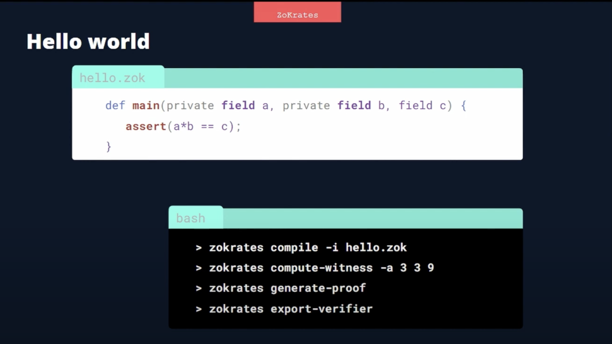

# ZoKrates

## About

- A high level language for SNARKs maths circuits.
- Compiles to R1CS (Rank-1 Constraint System).
- support for groth16, gm17 (evolution of g16), marlin (universal SNARKs), nova (new type of SNARKs having exciting use cases).
- Proving:
  - `bellman`
  - `arkworks`
  - `bellperson`
  - `snarkjs`
- Verifier:
  - EVM
  - CLI
  - JS

## Installation

[Source](https://zokrates.github.io/gettingstarted.html)

## Getting started

## Tools

### Playground

- [Native/locally](#installation)
- [Remix with Zokrates plugin](https://remix.ethereum.org/)
- [playground](https://play.zokrat.es/)
