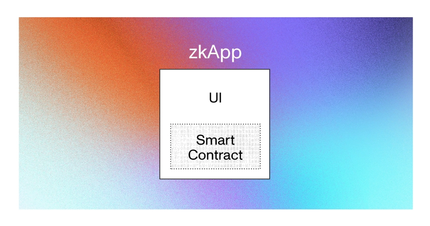
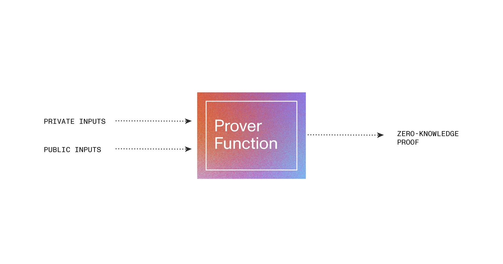

# Mina Protocol

## About

- Permissionless, Distributed computer.
- Lightweight, fast, and secure blockchain protocol.
- uses zk-SNARKs for scalability, security and privacy.
- maintained by [o1-labs](https://github.com/o1-labs)
- In traditional blockchain like Ethereum (after Merge), **all nodes must run the same calculation** to verify the execution of a dApp. This is wasting both energy & time. On Mina, Snapp is **executed only once by its creator** rather than the whole network, & after which all other nodes would just validate the proof that is associated with it. Hence, it's energy efficient & cost effective. Also, no more handing over your personal data like in case of bank loans (where social security, earning details, credit score etc. are required to be shared with the bank).
- We get to deploy Snapp (SNARK-Powered-DApp) which handles both scalability & privacy. Snapps are considerably more scalable than Ethereum DApps.
- zkApps are written in TypeScript using the Mina zkApp CLI.
- A “zkApp” consists of two parts:
  1. a smart contract &
  2. an UI (user interface) for users to interact with it.



- A zkApp developer writes circuits that gives 2 outputs:
  - **prover function**
    
  - **verifier function**
    ../../../img/mina-protocol-zkapp-verifier

## Installation

> For macOS M1.

[Source](https://docs.minaprotocol.com/zkapps/how-to-write-a-zkapp)

1. Install `zkapp-cli`:

```bash
npm install -g zkapp-cli
```

confirm using `zk --version`

<!-- TODO -->

## Getting Started

## Network

- Mainnet (zkApp not live yet)
- Testnet (Berkeley)

## References

- [zkApp Developer Resource Kit](https://github.com/o1-labs/zkapp-resource-kit)

### Videos

- By Mina Protocol
  - [What are Zero Knowledge Proofs? | Mina Protocol](https://www.youtube.com/watch?v=GvwYJDzzI-g) ✅
  - [Zero Knowledge Smart Contracts, Snapps/zkApps | Mina Protocol](https://www.youtube.com/watch?v=H_JQjPDwAH0) ✅
